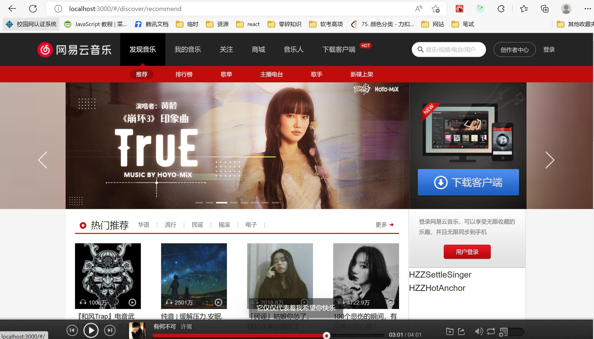
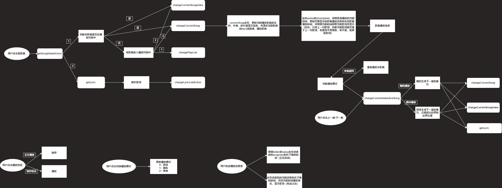

# music
  * 仿写网易云音乐
  * 项目持续更新中...
  * 该项目已部署，在2022年9月15日之前可以通过以下网址进行访问：http://1.15.226.59/

# 用法
  * 将项目下载，用vscode打开mymusic文件夹，在该文件夹下执行yarn install和yarn start就可将项目运行
# 功能
  * 项目实现的功能有：首页轮播图展示最新资讯，音乐热门推荐功能，web端音乐的顺序播放、随机播放等功能，音乐播放时同步歌词显示功能
# 技术栈
  * 使用React作为前端框架，使用函数式组件进行组件化开发，Redux进行状态管理，react-router-dom中的HashRoute和react-router-config中的renderRoutes管理路由，Ant Design作为前端UI框架， Axios进行网络请求
# 界面展示

# 歌曲播放逻辑梳理
